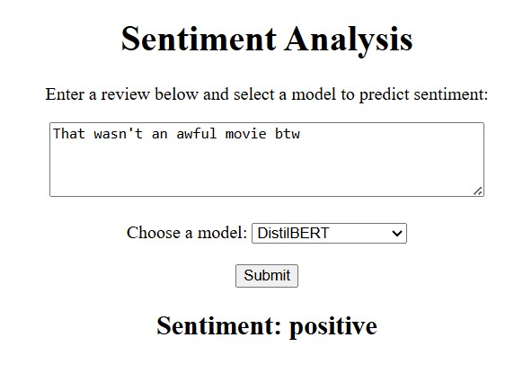

# Sentiment Analysis on IMDB Dataset
## Demo Picture


## Dataset
Download the dataset from Kaggle: [IMDB Dataset of 50K Movie Reviews](https://www.kaggle.com/datasets/lakshmi25npathi/imdb-dataset-of-50k-movie-reviews).

---

## Steps to Set Up and Run the Project

1. Clone the repository using the following command:
   ```bash
   git clone https://github.com/susanth18/imdb-sentiment-analysis.git
2. Ensure all dependencies are installed. Install them using the requirements.txt:
   ```bash
   pip install -r requirements.txt
3. Start the Flask server:
   ```bash
   python app.py
4. The server will run locally at http://127.0.0.1:5000.

## If you want to ingest the data into mysql, follow the below steps:
1. Save the downloaded dataset in the `Data_Ingestion` folder with the name data.csv.
2. Open `data_setup.py` and replace the following fields with your MySQL credentials:
   ```bash
   host="localhost",
   user="MYSQL_USER_NAME",
   password="YOUR_MYSQL_USER_PASSWORD",
   database="YOUR_DB_NAME"
3. Run the script to upload the dataset to MySQL:
   ```bash
   python data_setup.py

## Data Cleaning and EDA
1. Open the `Data_Cleaning_and_EDA.ipynb` notebook.
2. Run all the cells to perform:
Basic text preprocessing (e.g., lowercasing, punctuation removal, stopword removal).
Exploratory Data Analysis (EDA), including:
- Average review length.
- Sentiment distribution.
- Word clouds for positive and negative sentiments.
- Save the cleaned data for model training.

## Train the model
1. Open the `train_model.ipynb` notebook.
2. Run all the cells to:
- Train a baseline Logistic Regression model on TF-IDF features.
- Save the trained model as a joblib file for future predictions

## Test the API
Use the `test.py` script to


## Model Info

### Summary of the Chosen Model Approach:
- The project involves training a **baseline sentiment analysis model** using **Logistic Regression** with **TF-IDF** features as the initial approach.
- Additionally, a transformer-based model, **DistilBERT**, is used for comparison.

### Key Results:

#### Logistic Regression Model:
- **Training Accuracy**: 0.9324
- **Training Precision**: 0.9259
- **Training Recall**: 0.9401
- **Training F1-score**: 0.9329

#### Test Set Results:
- **Test Accuracy**: 0.8943
- **Test Precision**: 0.8847
- **Test Recall**: 0.9068
- **Test F1-score**: 0.8956


